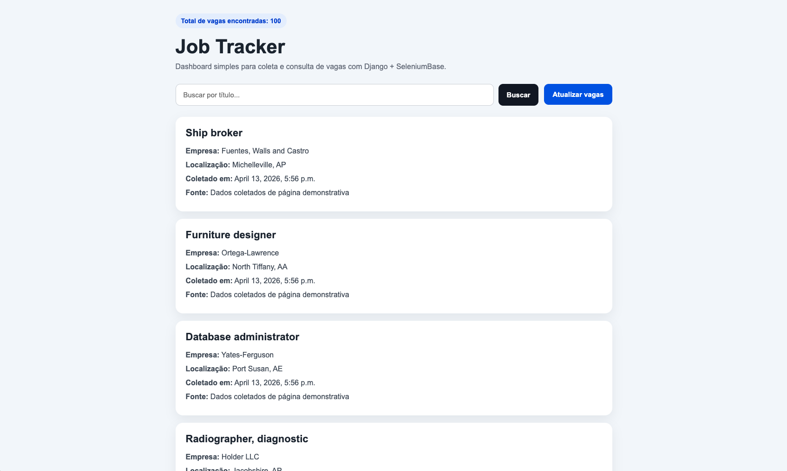
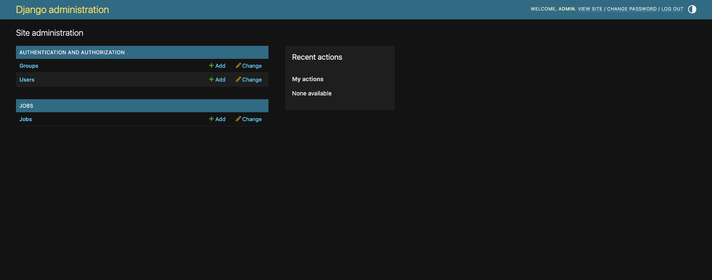
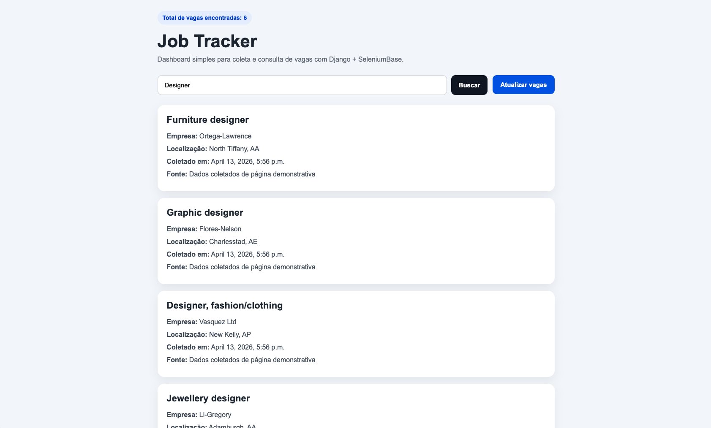

# Job Tracker RPA


Sistema de **automação web (RPA)** desenvolvido com **Python, Django e
SeleniumBase** para coletar, armazenar e visualizar vagas de emprego
automaticamente.

O projeto implementa um fluxo completo de automação:

-   coleta automatizada de dados via scraping
-   persistência em banco de dados
-   dashboard para visualização
-   API REST para consulta
-   execução automática via scheduler

------------------------------------------------------------------------

# Deploy Online

A aplicação está disponível online:

https://job-tracker-rpa.onrender.com

Exemplo:

    https://job-tracker-rpa.onrender.com/jobs/

Endpoints disponíveis:

    Dashboard
    /jobs/

    API
    /jobs/api/jobs/

    Admin
    /admin/

------------------------------------------------------------------------

# Demonstração

## Dashboard


    docs/dashboard.png



------------------------------------------------------------------------

## Painel Admin Django


    docs/admin.png



------------------------------------------------------------------------

## Busca de vagas


    docs/search.png



------------------------------------------------------------------------

# Arquitetura do Projeto

O fluxo do sistema funciona assim:

    GitHub Scheduler
            ↓
    GitHub Actions
            ↓
    Endpoint protegido Django
            ↓
    SeleniumBase Scraper
            ↓
    Banco de dados SQLite
            ↓
    Dashboard + API REST

------------------------------------------------------------------------

# Tecnologias Utilizadas

Backend

-   Python
-   Django
-   SeleniumBase

Infraestrutura

-   Render (deploy cloud)
-   GitHub Actions (scheduler automático)

Banco de Dados

-   SQLite

Frontend

-   HTML
-   CSS

------------------------------------------------------------------------

# Funcionalidades

✔ Web scraping automatizado de vagas\
✔ Armazenamento persistente em banco\
✔ Dashboard web para visualização\
✔ Busca por título de vaga\
✔ Painel administrativo Django\
✔ Endpoint de API REST\
✔ Atualização manual via interface\
✔ Automação programada via GitHub Actions

------------------------------------------------------------------------

# Estrutura do Projeto

    Job_Tracker
    │
    ├── core/
    │   ├── settings.py
    │   ├── urls.py
    │
    ├── jobs/
    │   ├── management/
    │   │   └── commands/
    │   │       └── scrape_jobs.py
    │   │
    │   ├── templates/
    │   │   └── jobs/
    │   │       └── job_list.html
    │   │
    │   ├── models.py
    │   ├── views.py
    │   ├── urls.py
    │   ├── scraper.py
    │
    ├── .github/
    │   └── workflows/
    │       └── refresh_jobs.yml
    │
    ├── manage.py
    ├── requirements.txt
    └── README.md

------------------------------------------------------------------------

# API

### Listar vagas

    GET /jobs/api/jobs/

Resposta:

``` json
{
  "jobs": [
    {
      "title": "Data Scientist",
      "company": "Example Corp",
      "location": "Remote",
      "url": "...",
      "collected_at": "2026-04-13"
    }
  ]
}
```

------------------------------------------------------------------------

# Automação (Scheduler)

O scraper é executado automaticamente via **GitHub Actions**.

Workflow:

    .github/workflows/refresh_jobs.yml

Cron configurado:

    a cada 6 horas

Fluxo:

    GitHub Actions
         ↓
    curl request
         ↓
    Render endpoint
         ↓
    Django scraper
         ↓
    dados atualizados

------------------------------------------------------------------------

# Como Executar Localmente

### 1 Clonar o repositório

``` bash
git clone https://github.com/SEU_USUARIO/job-tracker-rpa.git
cd job-tracker-rpa
```

------------------------------------------------------------------------

### 2 Criar ambiente virtual

Linux / Mac

``` bash
python -m venv venv
source venv/bin/activate
```

Windows

``` bash
venv\Scripts\activate
```

------------------------------------------------------------------------

### 3 Instalar dependências

``` bash
pip install -r requirements.txt
```

------------------------------------------------------------------------

### 4 Rodar migrações

``` bash
python manage.py migrate
```

------------------------------------------------------------------------

### 5 Executar scraping inicial

``` bash
python manage.py scrape_jobs
```

------------------------------------------------------------------------

### 6 Rodar servidor

``` bash
python manage.py runserver
```

------------------------------------------------------------------------

### Acessar

    http://127.0.0.1:8000/jobs/

------------------------------------------------------------------------

# Executando o Scraper

Via terminal

``` bash
python manage.py scrape_jobs
```

Via interface

Clique em **Atualizar vagas** no dashboard.

------------------------------------------------------------------------

# Como Funciona o Scraper

O scraper utiliza **SeleniumBase** para:

1 abrir página de vagas\
2 localizar cards de vagas\
3 extrair

-   título
-   empresa
-   localização
-   url

4 retornar dados estruturados\
5 salvar via Django ORM

Para evitar duplicação de registros é utilizada uma chave lógica baseada
em:

    title + company + location

------------------------------------------------------------------------

# Autor

Lucas Cruz

Projeto desenvolvido para estudo de **automação web (RPA) e backend com
Django**.

------------------------------------------------------------------------

# Licença

MIT
